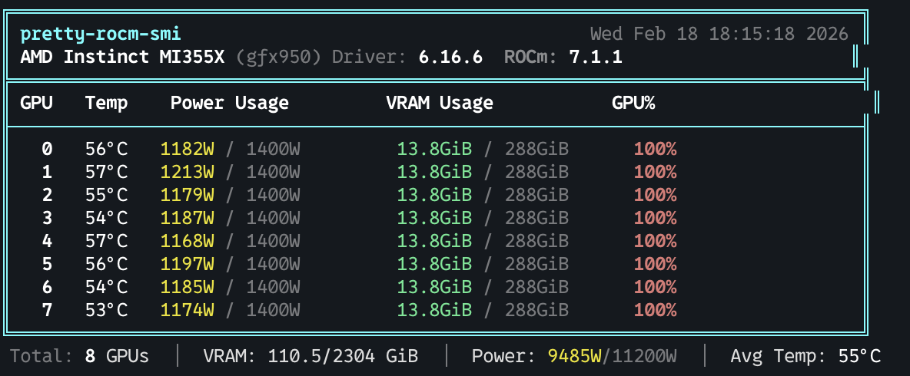

# pretty-rocm-smi

A prettier `rocm-smi` with color-coded GPU stats.



## Installation

```bash
curl -sL https://raw.githubusercontent.com/msaroufim/pretty-rocm-smi/master/install.sh | sh
```

Custom install directory:

```bash
curl -sL https://raw.githubusercontent.com/msaroufim/pretty-rocm-smi/master/install.sh | INSTALL_DIR=~/.local/bin sh
```

## Usage

```bash
pretty-rocm-smi
```

## Requirements

- Linux with AMD GPUs
- `rocm-smi` installed (comes with ROCm)
